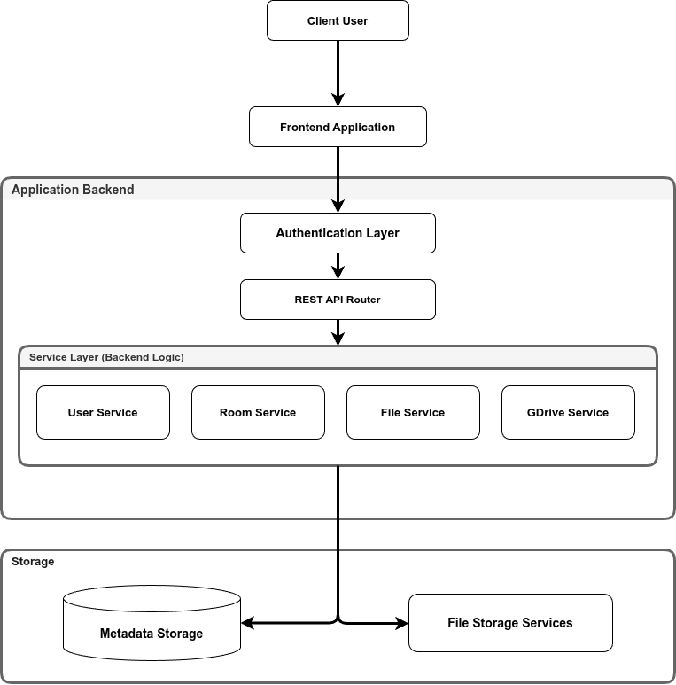

# BACSE344 - Cloud Infrastructure And Architecture

**Name**: Mukesh Raj Sakthi Thangaraj  
**Reg No**: 25BCE5059  
**DA Category**: Challenging Assignment  

---

### 1.1 Problem Statement

For users operating within Google Drive's free tier, managing files across multiple accounts leads to storage fragmentation. While Google provides a 15 GB free storage allocation per account, relying on a single account creates capacity limits for project files, media, and documents. To avoid paid storage subscriptions, users frequently create secondary Google accounts or share folders across teammates. However, this introduces account-switching friction, fragmented storage management, and difficulty locating files as primary accounts hit capacity limits.

GatherAround aggregates scattered Google Drive storage quotas into a password-protected virtual storage pool. Using a greedy bin-packing algorithm, the platform dynamically routes file uploads to whichever linked Google Drive account has available capacity, presenting a single virtual file system hierarchy.

### 1.2 System Architecture & Component Diagram

The platform follows a layered, decoupled system architecture. Request processing flows sequentially from the client through an authentication boundary before reaching backend API routers, business logic services, and downstream storage components:

#### Component Responsibilities & System Interactions:

1. **Client & Frontend Application**:
   - Provides the single-page user interface for room management, quota sliders, and file navigation.
   - Captures user interactions and dispatches HTTP requests to the backend API.

2. **Authentication Layer**:
   - Validates JWT session tokens and enforces room-level access authorization before forwarding requests to backend services.
   - Rejects unauthorized or unauthenticated API requests at the entry boundary.

3. **Application Backend & Service Layer**:
   - **REST API Router**: Receives validated requests from the Authentication Layer and routes them to appropriate service handlers.
   - **Service Layer (Backend Logic)**: Executes core application logic divided into four modules:
     - **User Service**: Manages user accounts, authentication tokens, and profile settings.
     - **Room Service**: Handles room creation, password validation, and member quota allocations.
     - **File Service**: Manages virtual folder hierarchies, file renaming, moving, and deletion.
     - **GDrive Service**: Manages OAuth 2.0 token refreshes and physical file streaming with the Google Drive API.

4. **Storage Container**:
   - **Metadata Storage**: Persists relational data in PostgreSQL, including user accounts, room membership allocations, password hashes, and virtual folder structures.
   - **File Storage Services**: Handles physical file storage, streaming downloads, and deletions on connected Google Drive accounts.

---

## Section 2: Application Development & Technology Stack

GatherAround is built using a decoupled client-server architecture. The table below lists the primary technologies powering each component of the application:

| Technology | Layer / Category | Usage in Application |
| :--- | :--- | :--- |
| **React 18 & Vite** | Frontend Framework | Single-page web user interface for room management and file navigation |
| **Vanilla CSS3** | UI Styling | Responsive design system, custom sliders, and theme styling |
| **Python 3.11 & FastAPI** | Backend API Server | REST API endpoints, business logic, and request routing |
| **Async SQLAlchemy & asyncpg** | Database ORM | Database modeling, async queries, and connection pooling |
| **Neon PostgreSQL 16** | Relational DBaaS | Data storage for users, rooms, membership quotas, and file metadata |
| **Google Drive API v3** | Cloud Storage API | Remote file uploads, folder creation, streaming, and deletions |
| **Google OAuth 2.0 API** | Identity & Authentication | User authentication and Google Drive access token management |

---

## Section 3: Database Design

GatherAround uses a relational PostgreSQL database hosted on Neon DBaaS with four core tables:

| Table | Description | Columns |
| :--- | :--- | :--- |
| **users** | User accounts & Google OAuth credentials | `id`, `email`, `name`, `google_access_token`, `google_refresh_token`, `storage_limit`, `storage_usage` |
| **rooms** | Virtual storage rooms created by users | `id`, `name`, `password`, `owner_id` |
| **user_rooms** | Room memberships & contributed storage allocations | `user_id`, `room_id`, `allocated_bytes`, `used_bytes`, `files_hosted_count`, `gdrive_folder_id` |
| **file_items** | Virtual folder hierarchies & file placement metadata | `id`, `room_id`, `parent_id`, `name`, `is_folder`, `size_bytes`, `mime_type`, `uploader_id`, `storage_user_id`, `gdrive_file_id`, `created_at` |

---

## Section 4: REST API Routers

The backend architecture is modularized into four primary API routers. For complete interactive testing, request/response schemas, and execution details, refer to the live [Swagger UI Documentation](https://cloud-storage-aggregator.onrender.com/docs):

| Router Prefix | Scope & Responsibilities |
| :--- | :--- |
| `/auth` | User authentication & Google OAuth 2.0 token exchange |
| `/users` | User profiles & storage capacity details |
| `/rooms` | Room creation, password access, and member quota allocations |
| `/files` | Greedy bin-packed file uploads, virtual folder hierarchies, file streaming & deletion |

### 4.1 CRUD & Database Operations Matrix

| Operation | Endpoint | Method | Target DB Table & SQL Operation | Description |
| :--- | :--- | :--- | :--- | :--- |
| **Create** | `/auth/signup` | `POST` | `INSERT INTO users` | Registers new user account |
| | `/rooms` | `POST` | `INSERT INTO rooms` | Creates a new virtual storage room |
| | `/rooms/{id}/join` | `POST` | `INSERT INTO user_rooms` | Joins a room with password authentication |
| | `/files/room/{id}/folder` | `POST` | `INSERT INTO file_items` | Creates a new virtual folder |
| | `/files/room/{id}/upload-intent-batch` | `POST` | `SELECT user_rooms` (quota check) | Evaluates bin-packing placement for file uploads |
| | `/files/room/{id}/complete-upload` | `POST` | `INSERT INTO file_items` | Saves file record and links Google Drive asset ID |
| **Read** | `/users/me` | `GET` | `SELECT FROM users` | Retrieves profile & storage metrics |
| | `/rooms` | `GET` | `SELECT FROM rooms JOIN user_rooms` | Lists user accessible storage rooms |
| | `/rooms/{id}/dashboard` | `GET` | `SELECT FROM user_rooms` | Fetches storage pool breakdown & statistics |
| | `/files/room/{id}` | `GET` | `SELECT FROM file_items` | Retrieves virtual folder hierarchy |
| | `/files/room/{id}/search` | `GET` | `SELECT FROM file_items WHERE name LIKE` | Searches files by keyword |
| | `/files/{id}/download` | `GET` | `SELECT FROM file_items` + GDrive API | Streams file directly from Google Drive |
| **Update** | `/rooms/{id}/contribute` | `POST` | `UPDATE user_rooms SET allocated_bytes` | Updates member contributed storage quota |
| | `/files/{id}/rename` | `PATCH` | `UPDATE file_items SET name` | Renames a virtual file or folder |
| | `/files/{id}/move` | `PATCH` | `UPDATE file_items SET parent_id` | Relocates file/folder to new parent directory |
| **Delete** | `/files/{id}` | `DELETE` | `DELETE FROM file_items` | Deletes virtual file record and remote Drive asset |
| | `/users/me` | `DELETE` | `DELETE FROM users` (Cascade) | Deletes user profile & cleans up allocations |

---

## Section 5: Cloud Deployment, Integration & Cloud Services Used

GatherAround deploys its system architecture components using three main cloud services: Platform-as-a-Service (PaaS) for application hosting, Database-as-a-Service (DBaaS) for data persistence, and Google Cloud APIs for drive integration:

| Cloud Service | Provider & Service Category | Description |
| :--- | :--- | :--- |
| **Render Static Site** | Render PaaS (Frontend CDN) | Hosts and serves the web frontend interface. |
| **Render Web Service** | Render PaaS (Backend Web Container) | Runs the Python FastAPI container that processes API requests, user auth, and file routing logic. |
| **Neon PostgreSQL** | Neon DBaaS (Serverless Relational Database) | Persists user accounts, room settings, virtual folder hierarchies, and file metadata. |
| **Google Cloud Console** | Google Cloud Platform (Cloud Storage API) | Manages OAuth 2.0 credentials and provides API access to perform file uploads and storage management on Google Drive. |

---

## Section 6: Live Production Links & Source Code

- **Deployed Application (Frontend)**: [https://gather-around.onrender.com](https://gather-around.onrender.com)
- **Deployed Backend API**: [https://cloud-storage-aggregator.onrender.com](https://cloud-storage-aggregator.onrender.com)
- **Interactive OpenAPI / Swagger Documentation**: [https://cloud-storage-aggregator.onrender.com/docs](https://cloud-storage-aggregator.onrender.com/docs)
- **Source Code Repository**: [https://github.com/mukesh-5059/Cloud-Storage-Aggregator](https://github.com/mukesh-5059/Cloud-Storage-Aggregator)
- **Demonstration Video**: Submitted as a separate video file (`demonstration_video.mp4`) along with this report.